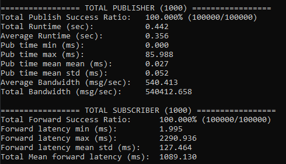
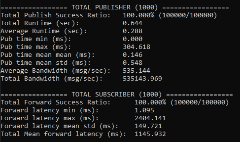
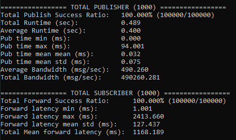
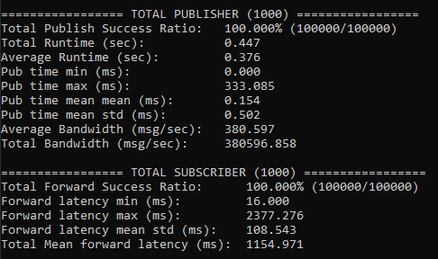
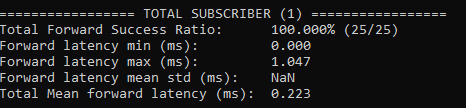
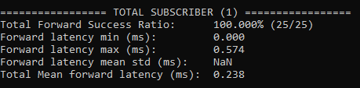
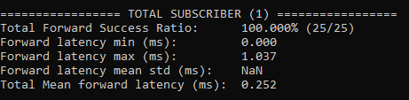
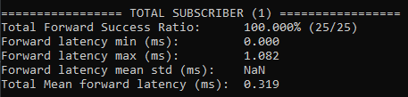

# Benchmark Results 

Best of 10 runs for each benchmark counted as result.

## 1000 Clients low length message spam (QoS 0)
EMQX(5.0.2) Benchmark Results :
<p></p>

Mosquitto(v2.0.14) Benchmark Results :
<p></p>

HiveMQ(v2022.1) Benchmark Results :
<p></p>

VerneMQ(v1.12.4) Benchmark Results :
<p></p>

## Single Client high length message spam only latency (QoS 1)
Mosquitto(v2.0.14) Benchmark Results :
<p></p>

EMQX(5.0.2) Benchmark Results :
<p></p>

HiveMQ(v2022.1) Benchmark Results :
<p></p>

VerneMQ(v1.12.4) Benchmark Results :
<p></p>

# About App

A MQTT test tool to measure the broker's forwarding latency.
Scenario: each topic has a subscriber and a publisher, the publisher publishes #count messages and the subscriber would measure the broker's forwarding latency by the timestamp inside each message's payload.
Some other measurement include publish success ratio, publish bandwidth, forwarding success ratio would also be count.

Installation:

```
go get github.com/hui6075/mqtt-bm-latency
```

All dependencies are vendored with [manul](https://github.com/kovetskiy/manul).

The tool supports multiple concurrent clients, configurable message size, etc:
```
> mqtt-bm-latency --help
Usage of ./mqtt-bm-latency:
  -broker string
        MQTT broker endpoint as scheme://host:port (default "tcp://localhost:1883")
  -topic string
        MQTT topic for outgoing messages (default "/test")
  -username string
        MQTT username (empty if auth disabled)
  -password string
        MQTT password (empty if auth disabled)
  -pubqos int
        QoS for published messages (default 1)
  -subqos int
        QoS for subscribed messages (default 1)
  -size int
        Size of the messages payload (bytes) (default 100)
  -clients int
        Number of clients pair to start (default 10)
  -count int
        Number of messages to send per pubclient (default 100)
  -keepalive int
        Keep alive period in seconds (default 60)
  -format string
        Benchmark results output format: text|json (default "text")
  -quiet
        Suppress logs while running


```

Two output formats supported: human-readable plain text and JSON.

Example use and output:

```
> mqtt-bm-latency --broker tcp://127.0.0.1:1883 --count 10 --size 100 --clients 10 --subqos 1 --pubqos 2 --format text
....

```
